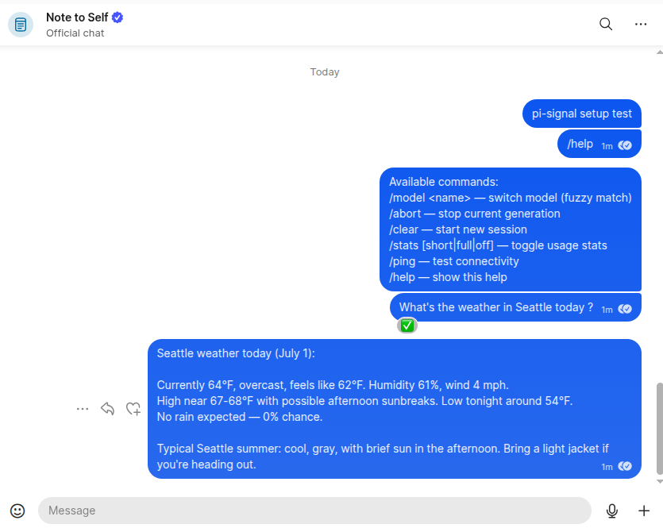
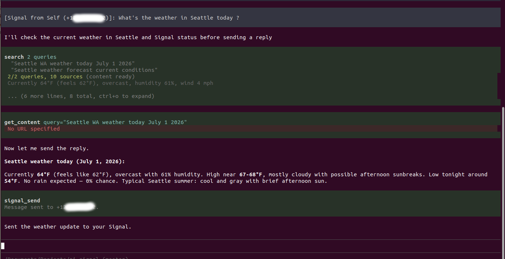
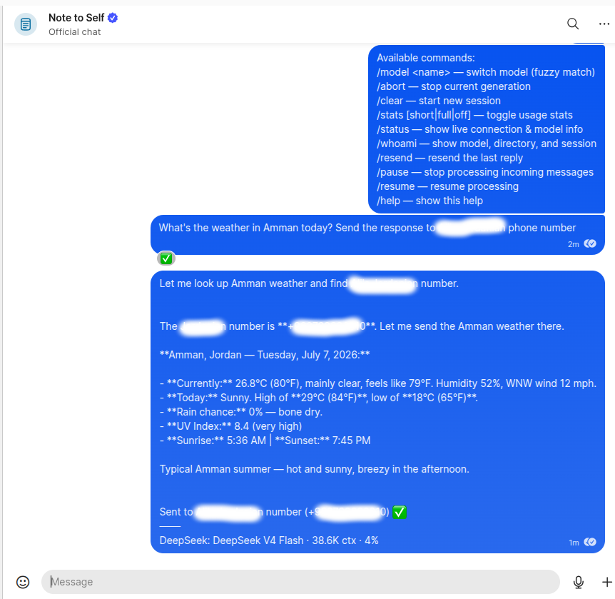
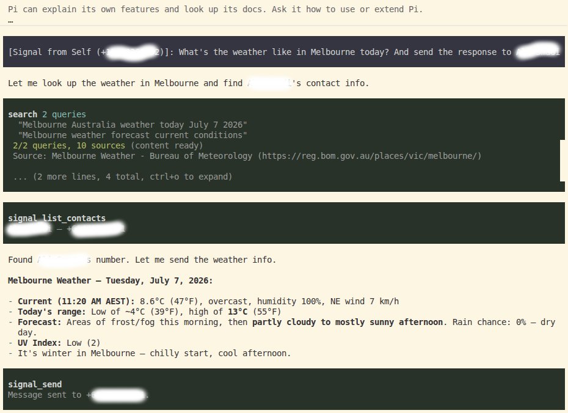

# @aalzubidy/pi-signal

Connect [pi](https://pi.dev) to [Signal Messenger](https://signal.org/) for two-way messaging. Send a **Note-to-Self** message from your phone → pi receives it, the LLM processes it, and pi replies back automatically.

> **Only Note-to-Self messages are processed.** Messages from other senders are silently ignored for security.

## How It Works

```
Phone (Note-to-Self) → signal-cli daemon (SSE in-memory) → pi extension
    → 👀 reaction → LLM processes → auto-reply → ✅ reaction
```

The extension connects directly to the signal-cli daemon's SSE endpoint over HTTP — **no log file on disk** (messages are streamed in-memory).

Commands (`/model`, `/abort`, `/clear`, `/stats`, `/status`, `/whoami`, `/resend`, `/pause`, `/resume`, `/help`) are handled locally without LLM. Everything else is forwarded to the LLM.





You can also send the response to someone else in your contacts using their name or phone number.





## Installation

**Prerequisites:** [signal-cli](https://github.com/AsamK/signal-cli/) in PATH, Java 25+, Signal app on your phone.

Installation has two separate layers — install the pi package from npm, then provision the
system daemon that receives Signal messages:

```bash
# 1. Install the pi package (no clone needed)
pi install @aalzubidy/pi-signal

# 2. In pi, run the setup wizard command. It checks Java/signal-cli, then prints the
#    exact `bash .../setup.sh` command to run in a terminal (needs sudo + a phone QR
#    scan, which pi's command can't do for you — it just locates the script for you).
/signal-setup

# 3. Run the command it prints, in a terminal:
bash /path/it/printed/scripts/setup.sh   # guides you through device linking, systemd service - **you might need to run it as sudo since it creates systemd service file**

# 4. setup.sh prints these two exports at the end — add them to your shell
#    config (~/.bashrc, ~/.zshrc, ~/.profile), then restart your shell:
export PI_SIGNAL_ACCOUNT=+1234567890   # your Signal number (E.164)
export PI_SIGNAL_PRIMARY=true          # marks this instance as the one handling Signal

# 5. Start pi (restart it or run /reload if already running)
pi
```

Send a Note-to-Self from your phone. pi receives it (👀), processes it, and replies automatically (✅).


## Environment Variables

| Variable | Required | Default | Description |
|---|---|---|---|
| `PI_SIGNAL_ACCOUNT` | Yes | — | Your Signal number in E.164: `+1234567890` |
| `PI_SIGNAL_PRIMARY` | No | `false` | Set `"true"` on the ONE instance handling Signal messages |
| `PI_SIGNAL_DAEMON_URL` | No | `http://127.0.0.1:8080` | Daemon URL for JSON-RPC and SSE |
| `PI_SIGNAL_STATS` | No | `short` | Stats mode: `off`, `short`, or `full` |
| `PI_SIGNAL_QUIET_DAEMON` | No | `true` | Keep message content out of journalctl (secure default). Set `"false"` to surface daemon output for debugging |

## Commands (from Signal)

| Command | Purpose |
|---|---|
| `/model <name>` | Switch model (fuzzy match) |
| `/abort` | Stop current generation |
| `/clear` | New session |
| `/stats [short\|full\|off]` | Toggle usage stats |
| `/status` | Live connection & model info (in-memory, never hangs — only answers when pi is up) |
| `/whoami` | Show model, working directory, and session |
| `/resend` | Re-send the last reply (recover a dropped message) |
| `/pause` | Stop processing incoming messages (commands still work) |
| `/resume` | Resume processing |
| `/help` | Show available commands |

> **Send to another number:** just ask the LLM naturally — e.g. *"summarize this and text it to +1555…"*, or by name: *"send this to Mike"*. For a name, the agent resolves it via `signal_list_contacts` first (names only resolve if signal-cli knows them — a synced contact or Signal profile name). The message goes to that number, and the agent's confirmation reply comes back to your Note-to-Self so you can see who it was sent to.

## TUI Commands (in pi)

`/signal-setup`, `/signal-start`, `/signal-stop`, `/signal-restart`, `/signal-status`, `/signal-logs [n]`, `/signal-send <+E164> <msg>`, `/signal-model`, `/signal-abort`, `/signal-stats`

## Tools (LLM-accessible)

- **`signal_send`** — Send a Signal message to a phone number (E.164)
- **`signal_status`** — Check connection status and health
- **`signal_list_contacts`** — List contacts (name → number) so the agent can resolve a name before sending

## Multiple Instances

Set `PI_SIGNAL_PRIMARY=true` on one pi instance. Other instances ignore Signal messages.

## Security

- Only **Note-to-Self** messages drive the agent; messages from other senders are ignored.
- Message content is streamed in-memory (no log file), and by default (`PI_SIGNAL_QUIET_DAEMON=true`) daemon output is kept out of `journalctl`.
- Third-party contact names from `signal_list_contacts` are sanitized before reaching the agent.
- The signal-cli daemon on `127.0.0.1:8080` is **unauthenticated** (a signal-cli limitation). It is bound to loopback, but any local process can reach it — so run pi-signal only on a **single-trusted-user host** and don't expose port 8080. See [SKILL.md](skills/signal/SKILL.md#security-model) for details.

## Troubleshooting

```bash
sudo systemctl status signal-receive.service
sudo journalctl -u signal-receive -f
curl -s http://127.0.0.1:8080/api/v1/check
# /signal-status in pi
```

See [skills/signal/SKILL.md](skills/signal/SKILL.md) for full troubleshooting.

## Files

```
pi-signal/
├── package.json
├── README.md
├── LICENSE
├── extensions/
│   └── signal.ts                # Main extension
├── skills/
│   └── signal/SKILL.md          # Full setup & troubleshooting guide
└── scripts/
    ├── setup.sh                 # Interactive setup wizard
    ├── signal-receive-loop.sh   # Native daemon manager
    └── signal-receive.service   # systemd unit template
```

## License

MPL-2.0 — see [LICENSE](LICENSE).